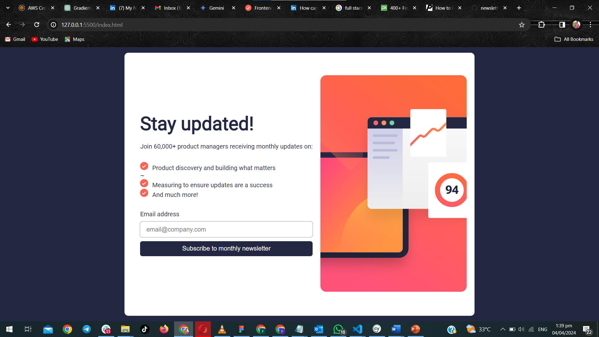

## Table of contents

- [Overview](#overview)
  - [The challenge](#the-challenge)
  - [Screenshot](#screenshot)
  - [Links](#links)
- [My process](#my-process)
  - [Built with](#built-with)
  - [What I learned](#what-i-learned)
  - [Continued development](#continued-development)
  - [Useful resources](#useful-resources)
- [Author](#author)
- [Acknowledgments](#acknowledgments)

## Overview

### The challenge
Users should be able to:

 1.Add their email and submit the form
 2.See a success message with their email after successfully submitting the form
 3.See form validation messages if:
 *The field is left empty
 *The email address is not formatted correctly
 *View the optimal layout for the interface depending on their device's screen size
 *See hover and focus states for all interactive elements on the page

 Screenshot

### Links

- Solution URL:https://github.com/adwoafaith/newletter
- Live Site URL: https://adwoafaith.github.io/newletter/

## My process
Throughout the development process, I employed various tools and techniques to create a functional and visually appealing solution. Here's an overview of the key aspects:

Built with
Semantic HTML markup: I prioritized using semantic HTML elements to ensure the structure of the page is meaningful and accessible. This not only enhances the user experience but also benefits search engine optimization.

CSS custom properties: Leveraging CSS variables, I facilitated easier styling adjustments across the project. By defining variables for colors, typography, and other design elements, I enhanced maintainability and flexibility in styling.

Flexbox: Employing Flexbox, I efficiently managed the layout and alignment of elements, particularly in responsive design scenarios. This allowed for seamless adaptation to different screen sizes and device orientations.

CSS Grid: To organize the layout of specific components, I utilized CSS Grid. This powerful layout system enabled precise control over the positioning and arrangement of elements within the design, enhancing visual consistency and coherence.

Mobile-first workflow: Following a mobile-first approach, I designed and developed the project with primary consideration for mobile responsiveness. This approach ensures that the user experience remains optimal on smaller screens, with progressive enhancements for larger devices.

React: I incorporated the React library to facilitate the creation of interactive components and manage the application's state efficiently. React's component-based architecture allowed for modular development and simplified maintenance.

By combining these technologies and methodologies, I was able to deliver a robust and well-structured solution that meets the project requirements and provides an optimal user experience across various devices and screen sizes.

### What I learnt

During this project, I learned how to effectively use JavaScript to handle form submission and validation. I also improved my CSS skills, especially in creating responsive layouts using Flexbox and CSS Grid.

### Continued development

I plan to continue improving my JavaScript skills and exploring more advanced CSS techniques. Additionally, I want to learn more about backend development to enhance the functionality of my projects.

### Useful resources

- https://www.w3schools.com/html/ - This helped me  to get some more advanced overview of html. I really liked this pattern and will use it going forward.
-https://www.w3schools.com/REACT/DEFAULT.ASP - react documentations on W3schools also help me to use the various react components.

## Author

- Website - [Faith Ayeh Mensah](https://www.your-site.com)
- Frontend Mentor - [adwoafaith](https://github.com/adwoafaith/newlette)

## Acknowledgments
I extend my heartfelt gratitude to Frontend Mentor for presenting this challenge, which has been instrumental in honing my coding abilities. Furthermore, I am indebted to the online community for their unwavering support and invaluable resources, which played a pivotal role in guiding me through the completion of this project.